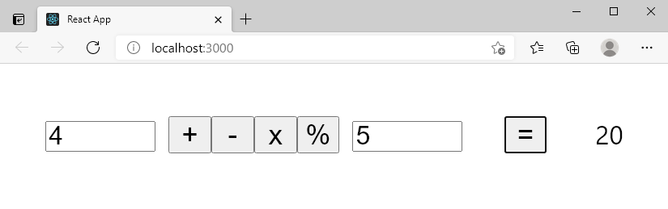

# Calculator in React

We're going to be building a simple calculator by incorporating what we've learned about React state and event listeners. We won't be creating nested components in this exercise so don't worry about making a components folder or writing your JS anywhere except in App.js.

## Instructions
1. Create two input fields: one will take the first number of your calculation, the other will take the second.
1. Create four buttons corresponding to four mathematical operations: add, subtract, multiply, divide.
1. Create an element on your page that displays the results of running a calculation.
1. Here is how your user will operate your calculator:
    - Enter a number in Box 1
    - Enter a number in Box 2
    - Click one of the four buttons ( + or - or x or % )
    - The result of the calculation will show in the results area.

## Core goals
1. Create a fresh react app with `yarn create react-app your-app-name`
1. `cd` into your new app, and `rm -rf .git`
1. Put your code in App.js and styling in App.css. We will make the whole calculator in one component for this exercise (since we haven't learned about lifting state yet)

## Stretch goals
1. The above described sequence of how to operate your calculator isn't how users operate "real-world" calculators. To make it more realistic, make your calculator operate by the below order of user actions:
    - Enter a number in Box 1
    - Click on one of the four buttons ( + or - or x or % )
    - Enter a number in Box 2
    - Click on the "equals" button
    - The result of the calculation will show in the results area
1. Hint: Don't get fooled by the labels on the buttons. For example, when you click the button labeled "+" the button labeled "=" will now perform addition when you click it. Similarly, when you click the button labeled "-" the button labeled "=" will now perform subtraction when you click it. And so on. This can be accomplished by having four different buttons that are all labeled "=" but only one is displayed at a time. Each of the "=" buttons performs a different mathematical operation. Think back to when Pete covered how to toggle between showing the "Color Changer" page and the "Counter" page, and apply that same approach to showing the appropriate "=" button corresponding to "+" or "-" or "*" or "/" depending on which of the four math operations buttons is clicked.

1. Another Hint: Think ternary operators (from our morning and afternoon lessons today)!

